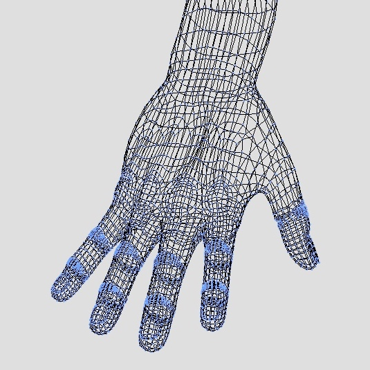
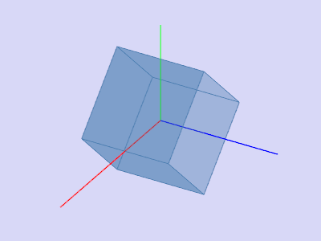
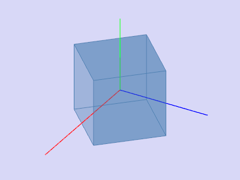

# 3DViewer - программа для просмотра каркасных модели в трехмерном пространстве
## Введение

В рамках курсовой работы была написана программа для просмотра каркасных моделей в 
трехмерном пространстве - **3DViewer**. Программа предоставляет возможность открывать и 
просматривать трехмерные модели в формате **Wavefront OBJ**. Данный формат является одним из наиболее
распространенных и широко используемых для обмена трехмерными моделями
и геометрическими данными. OBJ формат был разработан компанией **Wavefront
Technologies** в конце 1980-х годов и стал популярным благодаря своей простоте
и поддержке многих программ и приложений для трехмерной графики.
Формат файла **Wavefront OBJ** широко используется в различных программных средах и
приложениях, связанных с трехмерной
графикой и моделированием.
\
\
***Скриншот трехмерной модели в формате Wavefront OBJ из программы 3DViewer:***
\
\

\
Программу **3DViewer** можно разделить на две основные части:
- Библиотека для обработки *.obj* файлов на языке **C**
- Графический интерфейс на языке **C++** с использованием фреймворка **Qt6**. За отрисовку модели отвечает **OpenGL**.

В данной статье будет подробно рассмотрен формат **Wavefront OBJ**, а также библиотека отвечающая за обработку моделей записанных в данном формате.

## Формат представления моделей в трехмерном пространстве 

Wavefront OBJ (Object) - это широко используемый формат файла для 
хранения трехмерной геометрии и связанных данных. Он представляет собой текстовый
файл, в котором определяются вершины, текстурные координаты, нормали и индексы 
граней трехмерного объекта.

***Пример простого файла OBJ:***

```angular2html
# Это файл Wavefront OBJ

# Данные о вершинах
v 0.0 0.0 0.0
v 1.0 0.0 0.0
v 1.0 1.0 0.0
v 0.0 1.0 0.0

# Данные о текстурных координатах
vt 0.0 0.0
vt 1.0 0.0
vt 1.0 1.0
vt 0.0 1.0

# Данные о нормалях
vn 0.0 0.0 1.0

# Данные о гранях
f 1/1/1 2/2/1 3/3/1
f 1/1/1 3/3/1 4/4/1
```

В приведенном примере файл начинается с комментариев, которые предваряются 
символом `#`. Данные о вершинах определяются с использованием ключевого слова 
`v`, за которым следуют координаты **x**, **y** и **z** каждой вершины. Текстурные координаты
определяются с помощью ключевого слова `vt`, за которым следуют координаты **u** и **v**.
Нормали определяются с помощью ключевого слова `vn`, за которым следуют компоненты
**x**, **y** и **z** каждого вектора нормали.


Важно отметить, что файлы OBJ хранят только геометрию и основную информацию о 
материале. Дополнительные свойства материала, такие как текстуры, цвета или 
оттенки, обычно указываются через внешние файлы библиотеки материалов (MTL), 
которые связаны с файлом OBJ.

Для программы **3DViewer** потребуются только данные о вершинах и данные о гранях.
- Данные о вершинах:
Для каждой вершины используется ключевое слово `v`, за которым следуют три числа типа `double`,
представляющие координаты вершины в трехмерном пространстве. Например, строка 
`v 0.0 0.0 0.0` определяет вершину с координатами (0.0, 0.0, 0.0). В файле OBJ 
вершины перечисляются по одной на строку.
> Стоить заметить, что в системах Windows числа с плавающей точкой записываются
> через запятую.
- Грани определяются с использованием ключевого слова `f`. За ключевым словом
следуют наборы индексов вершин, текстурных координат и нормалей, определяющих
грани. Индексы разделены пробелами. Например, строка `f 1/1/1 2/2/1 3/3/1` 
определяет грань, состоящую из трех вершин с индексами 1, 2 и 3, соответствующих
вершинам, текстурным координатам и нормалям.
> Также стоит отметить, что нумерация в .obj файлах начинается с единицы.

***Рассмотрим пример:***

```angular2html
f 1 2 3
f 1/2 2/3 3/4
f 1/2/3 4/5/6 7/8/9
f 1//2 2//3 4//5
```
- 1 строка содержит только номера вершин. Строка говорит о том, что необходимо соединить первую, вторую и третью вершины.
- 2 строка содержит номера вершин и номера текстурных координат. Для данной программы текстурные координаты необходимо игнорировать.
- 3 строка содержит номера вершин, текстурных координат и координат нормали. Так же как и в предыдущем случае, нас интересуют только номера вершин.

## Выделение структуры данных
Первым шагом создания библиотеки для обработки *.obj* файлов является выделение
необходимой структуры данных. Для начала выделим два целочисленных поля для хранения
количества вершин и количества полигонов:

```c
typedef struct data {
  unsigned count_of_vertexes;
  unsigned count_of_facets;
  ...
} object_t;
```
> Использование `unsigned int` в данном случае будет более рациональным чем `int`, так как 
> количество вершин и полигонов не может быть отрицательным.

Теперь мы можем совершить первый проход по *.obj* файлу для подсчета количества вершин и полигонов. \
***Так может выглядеть реализация данной функции:***

```c
int get_count_of_v_f(const char* filename, unsigned* vertexes,
                     unsigned* facets) {
  ...
  while (error == OK && getline(&str, &len, f) != -1) {
    if (str[0] == 'v' && str[1] == ' ')
      ++(*vertexes);
    else if (str[0] == 'f' && str[1] == ' ')
      ++(*facets);
  }
  ...
}
```
Перейдем к выделению структуры данных для хранения вершин нашей трехмерной модели.
```c
typedef struct Matrix {
  double** matrix;
  unsigned rows;
  unsigned cols;
} matrix_t;
```

Для хранения вершин используем матрицу. Каждая строка матрицы соответствует определенной вершине модели.
> Так как нумерация вершин в .obj файле начинается с 1, оставим нулевую строку матрицы 
> пустой. В итоге размер матрицы будет `count_of_vertex + 1` на `3`.

Для хранения полигонов используем массив следующих структур:
```c
typedef struct facets {
  unsigned* vertexes;
  unsigned numbers_of_vertexes_in_facets;
} polygon_t;
```

В переменной `vertexes` будем хранить номера вершине, которые необходимо соединить, 
а в `number_of_vertexes_in_facets` количество вершин, которые необходимо соединить.
\
\
В конечном итоге, структура данных для хранения вершин и полигонов трехмерной модели будет выглядеть следующим образом:
```c
typedef struct data {
  unsigned count_of_vertexes;
  unsigned count_of_facets;
  matrix_t matrix_3d;
  polygon_t* polygons;
} object_t;
```
> Для массива `polygons` используем ту же хитрость, как и с матрицей вершин - оставим первую
> ячейку массива пустой для того, чтобы нумерация начиналась с единицы. Тогда размер 
> массива будет `count_of_facets + 1`.
> 
После первого прохода по файлу мы можем выделить память под нашу структуру. \
***Пример выделения памяти под матрицу с координатами вершин:***
```c
dst->matrix_3d.rows = dst->count_of_vertexes + 1;
dst->matrix_3d.cols = 3;
dst->matrix_3d.matrix = malloc(sizeof(double*) * dst->matrix_3d.rows);
for (unsigned i = 1; i < dst->matrix_3d.rows; ++i) {
  dst->matrix_3d.matrix[i] = malloc(sizeof(double) * 3);
}
```
Под структуру `polygons` необходимо выделить `(count_of_facets + 1) * sizeof(polygons)` байт.

Перейдем ко второму чтению *.obj* файла. Считываем строки начинающиеся на `v` и записываем 
координаты `x y z` в `matrix_3d.matrix[i][0], matrix_3d.matrix[i][0], matrix_3d.matrix[i][0]` соответственно.
\
***Пример реализации такой функции:***
```c
int write_vertexes_to_matrix(const char* filename, matrix_t matrix) {
  FILE* f = fopen(filename, "r");
  int error = f ? OK : ERROR;
  size_t len = 0;
  char* str = NULL;
  int i = 0;
  while (error == OK && getline(&str, &len, f) != -1 && i < matrix.rows) {
    if (str[0] == 'v' && str[1] == ' ') {
      ++i;
      char* token;
      strtok(str, " ");
      int j = 0;
      while (token = strtok(NULL, " "), j < 3 && token != NULL) {
        char* end_point;
        matrix.matrix[i][j] = strtod(token, &end_point);
        if (token == end_point) error = ERROR;
        ++j;
      }
      if (j != 3) error = ERROR;
    }
  }
  free(str);
  fclose(f);
  return error;
}
```
Для заполнения массива `polygons` придется проходить по строке начинающейся на `f`.
Это связано с тем что нам необходимо выделять память внутри каждой структуры
массива `polygons` под массив `vertexes`. При первом проходе по строке мы считаем
количество вершин, которые необходимо соединить, записываем это количество в переменную 
`numbers_of_vertexes_in_facets` и выделяем память под массив `vertexes`.
\
***Подсчет количества вершин:***
```c
unsigned get_count_of_vertex(char* str) {
  unsigned count = 0;
  char* token;
  strtok(str, " ");
  while (token = strtok(NULL, " "), token) ++count;
  return count;
}
```
***Выделение памяти:***
```c
unsigned count_of_vertex = get_count_of_vertex(buf);
polygons[i].numbers_of_vertexes_in_facets = count_of_vertex;
polygons[i].vertexes = (unsigned*)malloc(sizeof(int) * count_of_vertex);
```
При втором проходе по строке мы записываем номера вершин, которые необходимо соединить 
в массив `vertexes`.
***Пример функции записи номеров вершин в массив:***
```c
int write_vertex_to_array(char* str, unsigned* array, unsigned len) {
  int error = OK;
  char* token;
  strtok(str, " ");
  unsigned i = 0;
  while (token = strtok(NULL, " "), error == OK && token != NULL && i < len) {
    char* slash = strchr(token, '/');
    if (slash) *slash = '\0';
    char* point;
    array[i] = (int)strtol(token, &point, 10);
    if (token == point) error = ERROR;
    ++i;
  }
  return error;
}
```

На данном этапе чтение файла и выделение структуры завершено. Мы получили структуру 
данных в которой хранятся координаты вершин, их номера и номера вершин, которые необходимо соединить.

## Аффинные преобразования

Аффинные преобразования являются операциями над трехмерными объектами, которые 
сохраняют их форму, параллельность и отношения между точками. В контексте 
3D-графики и моделирования аффинные преобразования используются для перемещения, 
масштабирования, поворота и других преобразований трехмерных объектов.

***В программе 3DViewer реализованы три основных операции:***

- **Перенос:** Перенос перемещает объект вдоль осей координат на
заданное расстояние. Это выполняется путем добавления заданных значений 
смещения к координатам каждой вершины объекта. Например, для перемещения 
объекта на вектор **(dx, dy, dz)**, к каждой вершине прибавляются значения **dx**,
**dy** и **dz**.

Для реализации переноса необходимо пройти циклом по матрице вершин и
прибавить к каждой координате необходимое значение.

```c
void move_object(object_t* obj, double x, double y, double z) {
  if (obj) {
    for (unsigned i = 1; i < obj->matrix_3d.rows; ++i) {
      obj->matrix_3d.matrix[i][0] += x;
      obj->matrix_3d.matrix[i][1] += y;
      obj->matrix_3d.matrix[i][2] += z;
    }
  }
}
```
- **Масштабирование:** Масштабирование изменяет размер объекта вдоль 
каждой оси координат. Это достигается умножением координат каждой вершины 
объекта на соответствующие значения масштабирования. Например, для 
масштабирования объекта по оси **X** в **k** раз, координаты **X** каждой вершины 
умножаются на **k**.

Реализация масштабирования аналогична реализации переноса.

```c
void scale_object(object_t* obj, double k) {
  if (obj) {
    for (unsigned i = 1; i < obj->matrix_3d.rows; ++i) {
      obj->matrix_3d.matrix[i][0] *= k;
      obj->matrix_3d.matrix[i][1] *= k;
      obj->matrix_3d.matrix[i][2] *= k;
    }
  }
}
```
- **Поворот:** Поворот изменяет ориентацию объекта вокруг определенной оси.
Это выполняется с помощью матриц поворота, которые применяются к координатам 
вершин объекта. Поворот может быть выполнен вокруг оси **X**, **Y** или **Z**, а также 
вокруг произвольной оси в пространстве.

\
***Вращения объекта:***
\

\
\

\
Для реализации вращения необходимо использовать матрицу поворота. Подробнее 
про вращение фигуры в трехмерном пространстве можно почитать [здесь](https://grafika.me/node/82).

***Пример реализации поворота фигуры:***
```c
void rotate_object(object_t* obj, double alpha, double beta, double gama) {
  if (obj) {
    alpha *= M_PI_2 / 180;
    beta *= M_PI_2 / 180;
    gama *= M_PI_2 / 180;
    for (unsigned i = 1; i < obj->matrix_3d.rows; ++i) {
      double x = obj->matrix_3d.matrix[i][0];
      double y = obj->matrix_3d.matrix[i][1];
      double z = obj->matrix_3d.matrix[i][2];
      obj->matrix_3d.matrix[i][0] =
          cos(beta) * cos(gama) * x - sin(gama) * cos(beta) * y + sin(beta) * z;
      obj->matrix_3d.matrix[i][1] =
          (sin(alpha) * sin(beta) * cos(gama) + sin(gama) * cos(alpha)) * x +
          (-sin(alpha) * sin(beta) * sin(gama) + cos(alpha) * cos(gama)) * y -
          sin(alpha) * cos(beta) * z;
      obj->matrix_3d.matrix[i][2] =
          (sin(alpha) * sin(gama) - sin(beta) * cos(alpha) * cos(gama)) * x +
          (sin(alpha) * cos(gama) + sin(beta) * sin(gama) * cos(alpha)) * y +
          cos(alpha) * cos(beta) * z;
    }
  }
}
```

## Заключение
На этом разработку библиотеки, необходимой для работы программы **3DViewer**, можно считать законченной.
Библиотека предоставляет возможность считывать, хранить и совершать аффинные преобразования 
над трехмерной моделью в формате **Wavefront OBJ**. 
\
\
***Заголовочный файл библиотеки:***
```c
#ifndef INC_3DVIEWER_SRC_INCLUDE_OBJ_CONVERTER_H_
#define INC_3DVIEWER_SRC_INCLUDE_OBJ_CONVERTER_H_

typedef struct Matrix {
  double** matrix;
  unsigned rows;
  unsigned cols;
} matrix_t;

typedef struct facets {
  unsigned* vertexes;
  unsigned numbers_of_vertexes_in_facets;
} polygon_t;

typedef struct data {
  unsigned count_of_vertexes;
  unsigned count_of_facets;
  unsigned count_of_edges;
  matrix_t matrix_3d;
  polygon_t* polygons;
} object_t;

int get_object(const char* filename, object_t* dst);
void free_object(object_t* obj);
void move_object(object_t* obj, double x, double y, double z);
void rotate_object(object_t* obj, double alpha, double beta, double gama);
void scale_object(object_t* obj, double k);

#endif  // INC_3DVIEWER_SRC_INCLUDE_OBJ_CONVERTER_H_
```